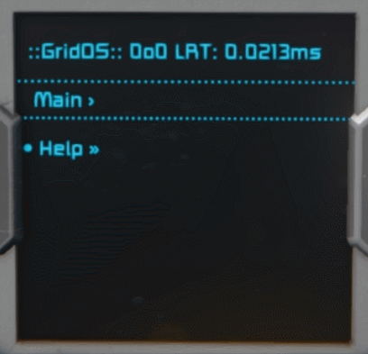

**Table of Contents**
<!-- Table of contents generated generated by http://tableofcontent.eu -->
  - [Summary](#summary)
  - [Architecture](#architecture)
  - [How does it work](#how-does-it-work)
  - [Planned Features](#planned-features)
  - [Getting started using the framework](#getting-started-using-the-framework)
  - [Example module class with all interfaces implemented](#example-module-class-with-all-interfaces-implemented)
  - [Instantiating the framework and registering a module](#instantiating-the-framework-and-registering-a-module)

**Note:** Project currently halted, for the most part, because in-game programming became a rather sidelined (i.e. "unofficial", disabled by default) feature in Space Engineers. But if you're interested in using the script, let me know, and I'll try to work on it a bit to implement some of the below mentioned planned features (especially the performance optimizations) and make a release version.

**Note 2:** If you happen to be interested in using the script for whatever purpose, **use the *Master* branch**, not the develop. Develop is in a sorry state currently (hey, it's just a one-person project :)). Will get back to it and finish what I started there.

## Menu Demo

The display module of GridOS basically creates a dynamic, navigable UI on top of a static textbox. Below there is a short demonstration of the menu handling capabilities, which includes: traversing tree structures, automatic word-wrapping, prefix and suffix bullet characters based on item type, auto-scrolling, and displaying navigation breadcrumbs. This demo doesn't cover other existing capabilities, e.g. executing commands and displaying automatically updating text.



## Summary
GridOS is a modular multitasking and command handling ingame script for Space Engineers. This script provides a framework for creating separate code modules to run on a single Programmable Block.

Additionally, it provides access to a highly flexible hierarchical menu system that implements intelligent automatic screen updates (when the underlying data changes), and supports showing different parts of the same menu hierarchy on different displays (additional displays can be added or removed dynamically at runtime).

**Very early version** – expect frequent changes, including breaking changes in the consumer-facing interfaces and classes. Primarily made for my own use, but if it seems useful to you, you can utilize it however you wish.

*Large architectural overhaul is coming, which will expand the capabilities of modules quite a bit.*

This readme gets outdated all the time due to the frequent changes, but I'll try to update it now and then.

## Architecture

* **Front Controller:** The main GridOS class (the one you're instantiating) is essentially sort of a Front Controller, providing a centralized entry point for requests, and hiding multiple dispatcher units, namely:
	* **Command dispatcher** for routing and dispatching argument based commands and their parameters.
	* **Update Dispatcher** for executing the scheduled recurring runs of modules.

* **Observer:** Modules and main state-holding objects notify each other of important property changes through the implementation of the Observer pattern, similarly to the INotifyPropertyChanged implementation used in .Net apps employing the Model-View-ViewModel (MVVM) architecture.

* **MVVM:** Speaking of MVVM, the most complex component of the system is the display component, which employs a structure similar to the MVVM (or MV-Controller-VM) pattern.
	* The clear separation of concerns between background data, data selection/filtering logic, and presentation logic provides a highly flexible architecture that supports multiple stateful "views" on the same underlying data, all with automatic update propagation.
	* The commands required for navigating the display content are registered in the Command Dispatcher, which provides a fast and relatively direct way of request delivery, instead of routing the navigation commands through multiple abstraction layers.

* **Composite:** The model (background data) part of the display system is mostly based on the Composite pattern, which means that it's a node-based hierarchical structure where nodes can contain additional nodes, creating a tree structure.
	* This node-based system is carefully planned with flexibility in mind:
		* Nodes don't have a defined parent, facilitating scenarios where nodes (e.g. commands) are reused in multiple parts of the tree structure. *(Just be careful if you want to walk the tree; to avoid circular references.)*
		* Group and Command type of nodes expose various events to facilitate the implementation custom event-driven functionality. *(Of course this means that you should take care to release references if you're disposing your listeners. I'll check if weak events can be used inside the Programmable Block.)*

## How does it work

- Each module is a separate class that implements the `IModule` interface. Implementing this interface is what makes you able to register the module in the `GridOS` instance. But `IModule` alone doesn't do anything; you need to indicate which features you want to use, by implementing any/all of the following interfaces:

  - `IUpdateSubscriber`: With this interface you can subscribe to recurring automatic execution, which simply requires setting an `UpdateFrequency` and declaring an `Update()` method. You can modify this frequency any time, and the system will adjust. The system dynamically changes the main frequency of the programmable block too, so it runs only when it is actually requested by at least one module.

  - `ICommandPublisher`: With this interface you can publish a list of commands. The methods linked to the commands will be executed when the programmable block receives the commands as an argument.
  
  - `IDisplayElementPublisher`: With this interface you can specify a display element to be shown in GridOS's display system. The display element can be a simple `DisplayElement`, for displaying non-interactive textual information; `DisplayCommand`, for displaying executable commands; and `DisplayGroup`, for creating a node that contains other nodes. This system is extremely flexible; you can create a fully custom hierarchy, and even change it during runtime, since most changes are designed to propage to the screen automatically. The `DisplayGroup` node type lets you subscribe to multiple events, e.g. `BeforeOpen`, so you can be notified when the group is about to be opened (for e.g. refreshing the information elements or command labels).

## Planned Features

- **Overhauled overall framework consumption model:** Instead of the static, compile-time implementation of `IUpdateSubscriber`, etc. interfaces, the framework will expose a service object through which modules can dynamically subscribe to, use, and unsubscribe from framework services during runtime.
- **Shared caching layer:** Currently all composed display system instances (basically the views on LCDs) process and format the displayed content individually. A single-instance, shared caching layer will be added that will store all processed elements, and all "views" will request the processing of elements through this caching layer. So if view A already traversed certain parts of the menu tree, displaying the same parts on view B, view C, etc. will be significantly faster.
- **Expanded selection of update frequencies:** E.g. 200 ticks, 1-2 minutes, etc. Currently the code modules can set only the vanilla update frequencies (`Update1`, `Update10`, `Update100`, and `None`).
- **Screen Update Aggregation:** Currently all changes in the displayed menu content are directly propagated to the display, which means that if you update multiple display elements in the same execution cycle, you're incurring increasing runtime costs (due to the repetitive processing/formatting of content). An aggregation layer will be added that collects all updates in a given cycle, and applies them in one go at the end of the cycle.
- **Load balancing:** Currently, if e.g. 10 modules are registered for the `Update100` tier, all of them will execute in the same Programmable Block invocation (in the same tick). I'm planning to introduce load-balancing, which will offset each module's running cycle. The tradeoff will be a higher base frequency of the Programmable Block itself. This feature will probably be switchable.
- **Interpreter:** I'm considering the possibility of building an interpreter into GridOS that can be used to define a menu tree - and possibly even commands - via a text field, without writing code modules. This would make it easier to use GridOS for simple informational menus, plus it would facilitate rapid use, and make the system available to non-programmer players.
- <s>**More screens to display, including a configuration screen:** Currently, GridOS' display capability is limited to displaying the menu of the registered commands. I'm planning to introduce multiple screens, for example a configuration or a status screen, or possibly giving the ability for each module to publish their own information/configuration screen.</s> Switched to hierarchical, composite node based tree stucture, where each group node serves as a "screen". Multi-display support added.
- **Communication and data sharing between modules:** Currently the modules are completely separated, but I want to add built-in options for inter-module communication. E.g. a message bus, in which modules can subscribe to topics, and publish payloads on topics.
- **Persistent storage for modules:** At the moment no persistent storage access is available for modules.
- **Exception handling for each module:** The main system will be protected from module exceptions. Either by discarding the malfunctioning module, or by forcing the modules to implement a Reset() method for resetting themselves.

## Getting started using the framework

*(Skip this section if you have Visual Studio and MDK already set up, and it's obvious to you how to add a shared project to your solution.)*

**Environment**

If you wish to utilize this framework in your scripting projects, you should be using:
- [Visual Studio](https://www.visualstudio.com/downloads/), and
- [MDK plugin](https://github.com/malware-dev/MDK-SE).

*The MDK plugin is the only comfortable way currently available for merging multiple project files into a single Programmable Block script.*

**Adding the framework as a shared project**

This project is created as a *shared project* that you can (after cloning or downloading it) add to your existing solutions, by selecting **File > Open > Project/Solution > Add to solution**. Afterwards you need to add a reference to it by right-clicking the **References** node in your own project (in Solution Explorer), then selecting **Add Reference > Shared Projects**, and checking the checkbox in front of **GridOS**.

**Deploying the finished script**

After you've written your script against the framework, and wish to transfer it to SE, right-click the solution node in Solution Explorer, and select **Deploy All MDK Scripts**. This command merges all files, including both the files of the framework and your own project files, into a single script file placed into SE's script folder, ready for selecting it in-game from the list of scripts.

## Example module class with all interfaces implemented

The class below, after instantiating it, and registering it in the `GridOS` instance, will have its `Update()` cycle called according to its `UpdateFrequency` setting. The specified `CommandItem` will be executable from argument, and the specified `DisplayElements` will appear on the system's display.

```csharp
public class ExampleModule : IModule, ICommandPublisher, IUpdateSubscriber, IDisplayElementPublisher
{
    public string ModuleDisplayName { get; } = "Example Module";

    public ObservableUpdateFrequency Frequency { get; } = new ObservableUpdateFrequency(UpdateFrequency.Update100);

    public List<CommandItem> Commands => _commands;
    private List<CommandItem> _commands = new List<CommandItem>();

    public IDisplayElement DisplayElement => _displayElement;
    private DisplayGroup _displayElement = new DisplayGroup("Menu Group");
    private DisplayCommand _myDisplayCommand;

    // Inject your dependencies through the constructor
    public ExampleModule()
    {
        _commands.Add(new CommandItem(
            CommandName: "SomeCommand",
            Execute: ExecuteSomeCommand
        ));

        _displayElement.AddChild(new DisplayElement("This can be any information"));
        // Save reference if you want to modify it later
        _myDisplayCommand = new DisplayCommand("Do something", DoSomething);
        _displayElement.AddChild(_myDisplayCommand);
    }

    public void Update(UpdateType updateType)
    {
        // Do something at each update cycle, call other methods, etc.
        // Modify UpdateFrequency any time if needed
        Frequency.Set(UpdateFrequency.Update10);
    }

    private void ExecuteSomeCommand(CommandItem sender, string param)
    {
        // Do something when command is called via argument
    }

    private void DoSomething()
    {
        // Do something when display command is selected
        _myDisplayCommand.Label = "This will update on the display";
        _displayElement.AddChild(new DisplayElement("This is some new information, dynamically added."));
    }
}
```

## Instantiating the framework and registering a module
The following example shows the current, simplified instantiation of the framework, along with the registration of a single module. The framework uses multiple components as dependencies, but the instantiation of these happens internally, to facilitate ease of use.

```csharp
private GridOS gridOS;

public Program()
{
    IMyTextPanel gridOSDisplay = GridTerminalSystem.GetBlockWithName("GridOSDisplay") as IMyTextPanel;

    gridOS = new GridOS(this);

    // For using display capabilities (optional).
    // Multi-display supported: Multiple textpanels can be registered.
    // Each display has their own view state of the same hierarchical menu system.
    // Each display creates its own unique navigation commands in the internal command registry.
    // Currently the commands for the first registered display are: Display1Up, Display1Down, and Display1Select.
    // Additonal displays added use an incremented version of these commands (e.g. Display2Up, etc.).
    gridOS.RegisterTextPanel(gridOSDisplay);

    ExampleModule exampleModule = new ExampleModule();
    gridOS.RegisterModule(exampleModule);
}

public void Main(string argument, UpdateType UpdateType)
{
    // Simply transfer control to the system, passing all parameters
    gridOS.Main(argument, UpdateType);
}
```
